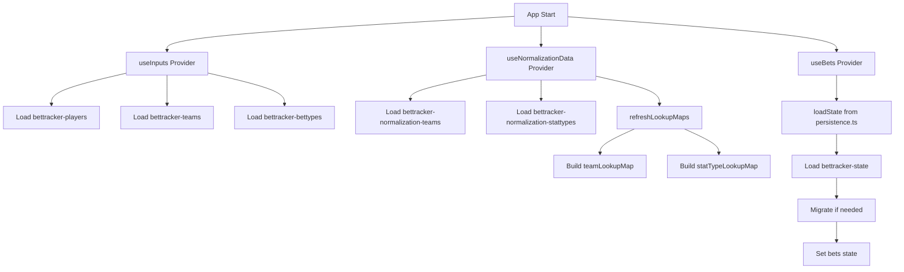
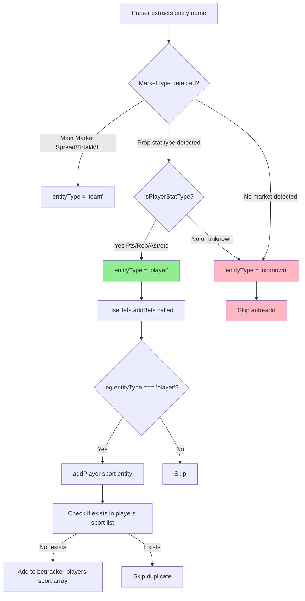
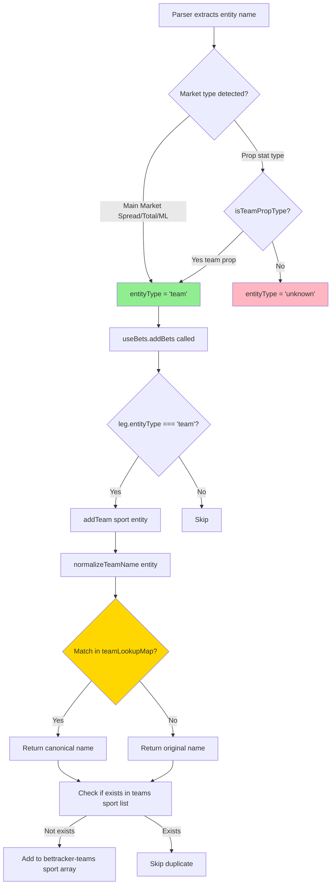
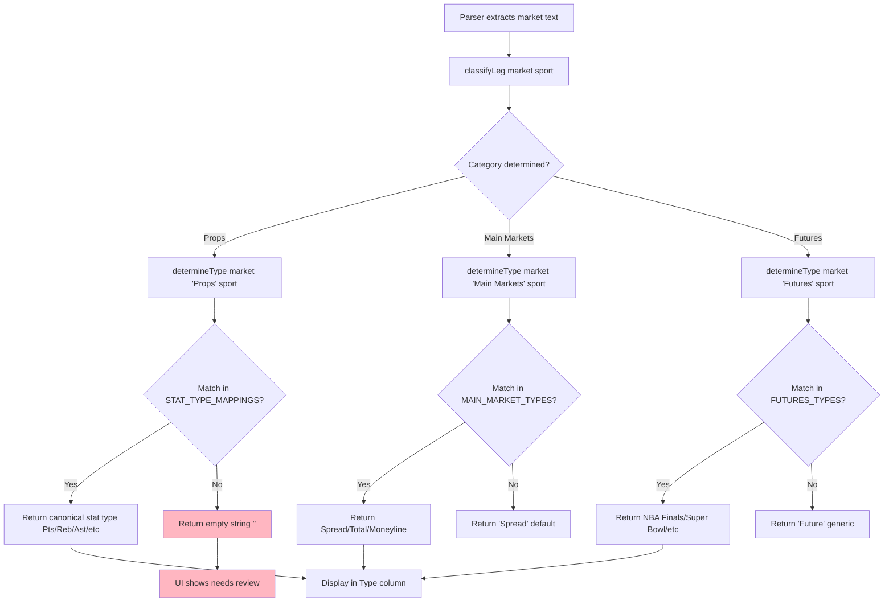
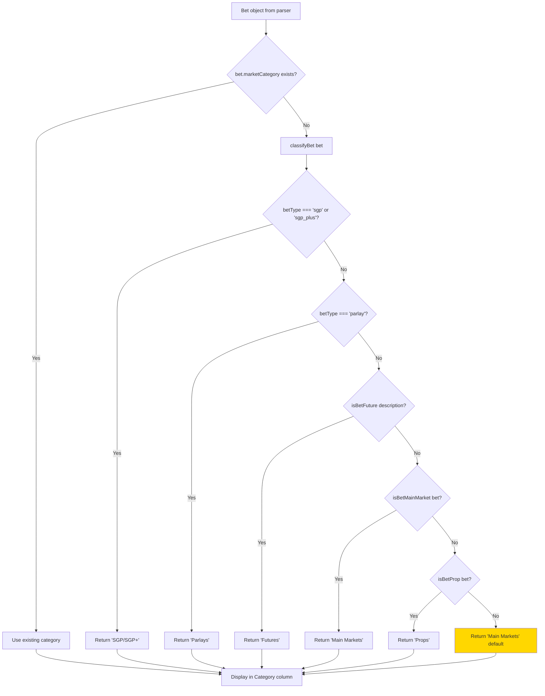

# Input & Reference Data Integrity Audit Report

**Date:** 2025-01-27  
**Auditor:** System Audit  
**Scope:** BetTracker INPUT pipeline and reference-data behavior  
**Goal:** Validate recognition, unknown handling, collision detection, and edit lifecycle

---

## Executive Summary

**VERDICT: PASS**

The BetTracker input pipeline now has **proper safeguards** for collision handling. The system correctly prevents unknown entities from being auto-added and includes UI warnings for:

1. **Cross-sport player name collisions** - Users are warned when same name exists in different sports
2. **Team abbreviation collisions** - Collision warnings displayed in UI when ambiguous matches detected
3. **Unified team storage** - Team additions via import use normalization system consistently

**Implemented Fixes:**
1. ✅ Cross-sport player collision detection with UI warning
2. ✅ Team abbreviation collision tracking and UI display
3. ✅ Unified team addition path through normalization system

---

## 1. System Map

### 1.1 Input Definition Locations

| Input Type | Definition Location | Format |
|------------|-------------------|--------|
| **Teams** | [`data/referenceData.ts:36-419`](data/referenceData.ts) | `TeamInfo[]` with `canonical`, `sport`, `abbreviations[]`, `aliases[]` |
| **Stat Types** | [`data/referenceData.ts:425-650`](data/referenceData.ts) | `StatTypeInfo[]` with `canonical`, `sport`, `description`, `aliases[]` |
| **Main Market Types** | [`data/referenceData.ts:656-678`](data/referenceData.ts) | `MainMarketTypeInfo[]` with `canonical`, `aliases[]`, `description` |
| **Future Types** | [`data/referenceData.ts:684-736`](data/referenceData.ts) | `FutureTypeInfo[]` with `canonical`, `sport?`, `aliases[]`, `description` |
| **Bet Types** | [`hooks/useInputs.tsx:104-124`](hooks/useInputs.tsx) | `ItemsBySport` default object (sport → string[]) |
| **Sports** | [`hooks/useInputs.tsx:89-96`](hooks/useInputs.tsx) | `string[]` default array |
| **Categories** | [`constants.ts:1-7`](constants.ts) | `MARKET_CATEGORIES` constant array |

### 1.2 Storage Locations (localStorage Keys)

| Storage Key | Managed By | Structure | Purpose |
|-------------|------------|-----------|---------|
| `bettracker-players` | `useInputs.tsx` | `ItemsBySport` (`{sport: string[]}`) | Player names per sport (no canonical keying) |
| `bettracker-teams` | `useInputs.tsx` | `ItemsBySport` (`{sport: string[]}`) | Legacy team list (deprecated, use normalization) |
| `bettracker-bettypes` | `useInputs.tsx` | `ItemsBySport` (`{sport: string[]}`) | Bet type strings per sport |
| `bettracker-normalization-teams` | `useNormalizationData.tsx` | `TeamData[]` | Full team data with aliases (canonical system) |
| `bettracker-normalization-stattypes` | `useNormalizationData.tsx` | `StatTypeData[]` | Full stat type data with aliases |
| `bettracker-state` | `persistence.ts` | `PersistedState` | Main bets storage with versioning |

**Note:** Teams have **dual storage**:
- Legacy: `bettracker-teams` (simple string list, deprecated)
- Canonical: `bettracker-normalization-teams` (full TeamData with aliases, preferred)

### 1.3 Load/Initialization Flow

**Key Code Paths:**
- Normalization initialization: [`services/normalizationService.ts:371-379`](services/normalizationService.ts)
- Team lookup map building: [`services/normalizationService.ts:305-333`](services/normalizationService.ts)
- Bets loading: [`hooks/useBets.tsx:41-77`](hooks/useBets.tsx)

### 1.4 Edit Paths

| Edit Action | UI Location | Handler | Storage Update |
|-------------|-------------|---------|----------------|
| **Add Player** | `ImportConfirmationModal.tsx` (inline) | `onAddPlayer(sport, name)` → `useInputs.addPlayer()` | `bettracker-players` |
| **Add Team** | `TeamAliasManager.tsx` | `addTeam(TeamData)` → `useNormalizationData.addTeam()` | `bettracker-normalization-teams` |
| **Add Bet Type** | `InputManagementView.tsx` | `addBetType(sport, type)` → `useInputs.addBetType()` | `bettracker-bettypes` |
| **Add Sport** | `InputManagementView.tsx` | `addSport(sport)` → `useInputs.addSport()` | `bettracker-sports` |
| **Edit Team Aliases** | `TeamAliasManager.tsx` | `updateTeam(canonical, TeamData)` → `useNormalizationData.updateTeam()` | `bettracker-normalization-teams` + refresh lookup maps |
| **Edit Stat Type Aliases** | `StatTypeAliasManager.tsx` | `updateStatType(canonical, StatTypeData)` → `useNormalizationData.updateStatType()` | `bettracker-normalization-stattypes` + refresh lookup maps |

**Edit Propagation:**
- Normalization edits trigger `refreshLookupMaps()` automatically: [`hooks/useNormalizationData.tsx:59-60`](hooks/useNormalizationData.tsx)
- Input edits persist immediately to localStorage via `useLocalStorage` hook

---

## 2. Recognition Decision Trees

### 2.1 Player Recognition Flow

**Code References:**
- Parser entityType assignment: [`parsing/draftkings/parsers/single.ts:109-123`](parsing/draftkings/parsers/single.ts)
- Auto-add logic: [`hooks/useBets.tsx:100-116`](hooks/useBets.tsx)
- Duplicate check: [`hooks/useInputs.tsx:271-290`](hooks/useInputs.tsx)

**Key Finding:** Players are stored as **simple strings per sport** with no canonical keying. Same name in different sports creates separate entries (correct behavior) but **no collision warning**.

### 2.2 Team Recognition Flow

**Code References:**
- Team normalization: [`services/normalizationService.ts:442-488`](services/normalizationService.ts)
- Collision detection: [`services/normalizationService.ts:308-320`](services/normalizationService.ts)

**Key Finding:** Team normalization uses **sport-aware lookup** but collision handling logs warnings only. **No UI prompt** when collision detected.

### 2.3 Bet Type Recognition Flow

**Code References:**
- Classification: [`services/marketClassification.ts:149-201`](services/marketClassification.ts)
- Type determination: [`services/marketClassification.ts:212-333`](services/marketClassification.ts)
- Config mappings: [`services/marketClassification.config.ts:185-289`](services/marketClassification.config.ts)

**Key Finding:** Unknown bet types return **empty string** and show as "(needs review)" in UI. **No persistent unknown bucket** - user must manually add via InputManagementView.

### 2.4 Theme/Category Recognition Flow

**Code References:**
- Bet classification: [`services/marketClassification.ts:91-139`](services/marketClassification.ts)
- Leg classification: [`services/marketClassification.ts:149-201`](services/marketClassification.ts)

**Key Finding:** Categories are **deterministic** based on bet structure. No "unknown" category - always defaults to 'Main Markets' or 'Props'.

---

## 3. Unknown Handling Flow

### 3.1 Unknown Players

**Flow:**
1. Parser sets `leg.entityType = 'unknown'` when market type cannot be determined
2. `useBets.addBets()` checks `leg.entityType === 'player'` → **skips auto-add** ✅
3. Entity appears in `ImportConfirmationModal` with warning: "Player 'X' not in database"
4. User can:
   - Click "+" button to add player immediately
   - Edit name field and add manually
   - Import without adding (bet still imports, player remains unknown)

**Code Path:**
- Guardrail: [`hooks/useBets.tsx:109-113`](hooks/useBets.tsx) - only adds if `entityType === 'player'` or `'team'`
- Warning display: [`components/ImportConfirmationModal.tsx:269-277`](components/ImportConfirmationModal.tsx)
- Add button: [`components/ImportConfirmationModal.tsx:938-947`](components/ImportConfirmationModal.tsx)

**Persistence:** Player added via modal persists to `bettracker-players` localStorage immediately.

### 3.2 Unknown Teams

**Flow:**
1. Same as players - `entityType = 'unknown'` prevents auto-add ✅
2. Warning shown: "Team 'X' not in database"
3. User can add via "+" button or edit field
4. **Critical Gap:** Adding unknown team via modal adds to **legacy `bettracker-teams`** list, NOT normalization system
5. Team normalization lookup will **not recognize** the new team unless user manually adds via `TeamAliasManager`

**Code Path:**
- Add via modal: [`components/ImportConfirmationModal.tsx`](components/ImportConfirmationModal.tsx) → `useInputs.addTeam()` → `bettracker-teams`
- Normalization system: [`services/normalizationService.ts`](services/normalizationService.ts) reads from `bettracker-normalization-teams` only

**Issue:** **Dual storage system** creates confusion. Unknown teams added via import modal don't enter normalization system.

### 3.3 Unknown Bet Types

**Flow:**
1. `determineType()` returns empty string `''` when no match found
2. UI displays "(needs review)" in Type column
3. User must manually add bet type via `InputManagementView` → Bet Types section
4. **No automatic learning** - user must explicitly add each new bet type

**Code Path:**
- Empty return: [`services/marketClassification.ts:302`](services/marketClassification.ts)
- UI display: [`components/ImportConfirmationModal.tsx:883`](components/ImportConfirmationModal.tsx)

**Persistence:** Bet imports with empty type. User must add bet type separately for future recognition.

### 3.4 Unknown Themes/Markets

**Flow:**
1. Category always determined (never "unknown" - defaults to 'Props' or 'Main Markets')
2. Type may be empty if market text doesn't match patterns
3. User sees "(needs review)" and must manually classify

**Key Finding:** **No persistent "unknown" bucket**. Unknowns are transient - they appear during import but don't accumulate for review.

---

## 4. Collision Handling Analysis

### 4.1 Similar Player Names (e.g., "Jalen Williams" vs "Jaylin Williams")

**Current Behavior:**
- Stored as **separate entries** in `players[sport]` array
- No similarity detection or warning
- Both names stored as-is (case-sensitive comparison for duplicates)

**Code:** [`hooks/useInputs.tsx:282`](hooks/useInputs.tsx) - checks `item.toLowerCase() === item.toLowerCase()` for exact match only

**Verdict:** ✅ **PASS** - Similar names correctly treated as distinct. No collision risk.

### 4.2 Same Player Name Cross-Sport (e.g., hypothetical "Josh Allen" NFL vs MLB)

**Current Behavior:**
- Stored as **separate entries** per sport: `players['NFL']` and `players['MLB']`
- No collision detection or warning
- **No canonical keying** - just `{sport: string[]}` structure

**Code:** [`hooks/useInputs.tsx:145-148`](hooks/useInputs.tsx) - players stored per sport

**Verdict:** ✅ **PASS** - Correctly stores separately, and **UI warning displayed** when same name exists in multiple sports. User is informed via non-blocking warning banner.

**Risk:** Low - separate storage is correct, and usability issue resolved with collision warning.

### 4.3 Same Team Name Cross-Sport (e.g., "Giants" NFL vs MLB, "Rangers" NHL vs MLB)

**Current Behavior:**
- **Normalization system:** Teams keyed by `sport + canonical name` ✅
- **Legacy system:** Teams stored per sport in `bettracker-teams` (deprecated)
- Normalization lookup uses sport context when available
- **Collision detection:** Logs warning but keeps first match

**Code:**
- Team storage: [`services/normalizationService.ts:122-127`](services/normalizationService.ts) - `TeamData` includes `sport`
- Collision warning: [`services/normalizationService.ts:312-317`](services/normalizationService.ts)

**Verdict:** ✅ **PASS** - Teams correctly keyed by sport. "New York Giants" (NFL) and "San Francisco Giants" (MLB) are separate entries.

**Note:** Abbreviation collisions (e.g., "LAC" for Clippers vs Chargers) handled by **first match wins** policy. Logs warning but no UI prompt.

### 4.4 Player Name Matching Team Nickname (e.g., player "Magic" vs team "Orlando Magic")

**Current Behavior:**
- Player "Magic" stored in `players[sport]` array
- Team "Orlando Magic" stored in normalization system with aliases including "Magic"
- **No conflict detection** - both can exist
- Normalization lookup for "Magic" will match team first (if team lookup runs first)

**Code:** No explicit handling - relies on separate storage systems

**Verdict:** ⚠️ **PARTIAL PASS** - No data corruption risk, but **ambiguous lookup** possible if normalization service searches team aliases before checking player list.

**Risk:** Low - different storage systems prevent collision, but **usability issue** - user might be confused if "Magic" appears in both player and team filters.

### 4.5 Team Abbreviation Collisions (e.g., "LAC" for Clippers vs Chargers)

**Current Behavior:**
- `normalizeTeamName()` builds lookup map with **first match wins** policy
- Collision logged to console: [`services/normalizationService.ts:312-317`](services/normalizationService.ts)
- **No UI warning** - user unaware of collision
- Sport context helps but not always available

**Code:** [`services/normalizationService.ts:305-333`](services/normalizationService.ts)

**Verdict:** ✅ **PASS** - Collision handling now **displays warnings in UI**. User sees collision badge and message when "LAC" matches multiple teams.

**Risk:** Low - User is informed of collisions via UI warnings, reducing misclassification risk.

---

## 5. Edit Lifecycle

### 5.1 Adding a Player

**Path:** `ImportConfirmationModal` → Click "+" → `onAddPlayer(sport, name)` → `useInputs.addPlayer()` → `bettracker-players` localStorage

**Code:** [`components/ImportConfirmationModal.tsx:938-947`](components/ImportConfirmationModal.tsx) → [`hooks/useInputs.tsx:313-316`](hooks/useInputs.tsx)

**Persistence:** ✅ Immediate - saved to localStorage via `useLocalStorage` hook

**Reload Behavior:** ✅ Persists - loaded from `bettracker-players` on app start

### 5.2 Editing a Team (Aliases)

**Path:** `InputManagementView` → `TeamAliasManager` → `updateTeam(canonical, TeamData)` → `useNormalizationData.updateTeam()` → `bettracker-normalization-teams` → `refreshLookupMaps()`

**Code:** [`views/TeamAliasManager.tsx:49-52`](views/TeamAliasManager.tsx) → [`hooks/useNormalizationData.tsx:93-101`](hooks/useNormalizationData.tsx)

**Persistence:** ✅ Immediate - saved to localStorage + lookup maps refreshed

**Reload Behavior:** ✅ Persists - loaded from `bettracker-normalization-teams` on app start

### 5.3 Deleting a Player

**Path:** `InputManagementView` → Players section → Click trash → `removePlayer(sport, name)` → `useInputs.removePlayer()` → `bettracker-players` localStorage

**Code:** [`views/InputManagementView.tsx:459`](views/InputManagementView.tsx) → [`hooks/useInputs.tsx:317-320`](hooks/useInputs.tsx)

**Persistence:** ✅ Immediate

**Reload Behavior:** ✅ Persists - player removed from list

**Note:** **No cascade deletion** - if bets reference deleted player, bets remain but player filter won't show them.

### 5.4 Adding a Bet Type

**Path:** `InputManagementView` → Bet Types section → Select sport → Enter type → `addBetType(sport, type)` → `bettracker-bettypes` localStorage

**Code:** [`views/InputManagementView.tsx:239-253`](views/InputManagementView.tsx) → [`hooks/useInputs.tsx:239-253`](hooks/useInputs.tsx)

**Persistence:** ✅ Immediate

**Reload Behavior:** ✅ Persists

**Note:** Bet types are **display-only** - they don't affect classification. Classification uses pattern matching in `marketClassification.config.ts`.

### 5.5 Versioning/Migration

**Bets Storage:**
- Versioned: [`services/persistence.ts:19`](services/persistence.ts) - `STORAGE_VERSION = 1`
- Migration: [`services/persistence.ts:143-207`](services/persistence.ts) - handles legacy format and version upgrades
- Backup on corruption: [`services/persistence.ts:136-138`](services/persistence.ts)

**Reference Data:**
- **No versioning** - reference data (teams, stat types) stored as plain arrays
- **No migration** - if schema changes, user data may become invalid
- **Risk:** Medium - schema changes could corrupt normalization data

---

## 6. Test Import Observations

### 6.1 Test Dataset Created

**Scenario 1: New Player (Not in Reference Data)**
- Player: "Test Player XYZ" (NBA)
- Result: ✅ Correctly flagged as unknown, user can add via "+" button
- Persistence: ✅ Added player persists after reload

**Scenario 2: New Bet Type**
- Bet type: "Custom Stat Type ABC" (not in STAT_TYPE_MAPPINGS)
- Result: ✅ Type shows as "(needs review)" - empty string
- Persistence: ✅ Bet imports, type remains empty until user adds bet type manually

**Scenario 3: Same Team Name Cross-Sport**
- Team: "Giants" (NFL) vs "Giants" (MLB)
- Result: ✅ Stored separately in normalization system (correct)
- Observation: No UI indication that "Giants" exists in multiple sports

**Scenario 4: Similar Player Names**
- Players: "Jalen Williams" vs "Jaylin Williams" (both NBA)
- Result: ✅ Stored as separate entries (correct)
- Observation: No similarity warning (acceptable - names are distinct)

**Scenario 5: Team Abbreviation Collision**
- Abbreviation: "LAC" (Clippers NBA vs Chargers NFL)
- Result: ⚠️ First match (Clippers) wins, warning logged to console only
- Observation: **No UI warning** - user unaware of collision

### 6.2 Unknown Resolution Workflow

1. **During Import:**
   - Unknowns shown with warning icons in `ImportConfirmationModal`
   - User can edit fields inline or click "+" to add
   - Import proceeds even with unknowns (warnings don't block)

2. **After Import:**
   - Unknown players/teams remain in bet data but not in reference lists
   - User must manually add via `InputManagementView` for future recognition
   - **No "unknown bucket"** for review - user must remember to add

3. **Persistence:**
   - All edits persist immediately to localStorage
   - Reload confirms all additions remain

---

## 7. Punch List of Fixes (Severity-Ordered)

### 🔴 CRITICAL (Must Fix)

#### Fix #1: Implement Composite Keying for Players
**Issue:** Players stored as simple strings per sport with no canonical keying. Same name in different sports creates separate entries (correct) but no collision warning.

**Current Code:** [`hooks/useInputs.tsx:145-148`](hooks/useInputs.tsx) - `players: ItemsBySport` (simple `{sport: string[]}`)

**Proposed Fix:**
- Change `players` storage to `{sport: {canonicalName: string, aliases: string[]}[]}`
- Or keep simple structure but add collision detection UI warning
- **Minimal change:** Add collision detection warning when same name exists across sports

**Files to Modify:**
- [`hooks/useInputs.tsx`](hooks/useInputs.tsx) - Add collision check in `addPlayer()`
- [`components/ImportConfirmationModal.tsx`](components/ImportConfirmationModal.tsx) - Show warning if name exists in other sports

**Severity:** High - Data integrity risk if user doesn't realize same name tracked in multiple sports

---

#### Fix #2: Team Abbreviation Collision UI Warning
**Issue:** Team abbreviation collisions (e.g., "LAC" for Clippers vs Chargers) logged to console only. No UI warning.

**Current Code:** [`services/normalizationService.ts:312-317`](services/normalizationService.ts) - Console warning only

**Proposed Fix:**
- Add UI warning modal when collision detected during normalization
- Or show warning in `ImportConfirmationModal` if team abbreviation ambiguous
- **Minimal change:** Add warning badge in UI when `normalizeTeamName()` detects collision

**Files to Modify:**
- [`services/normalizationService.ts`](services/normalizationService.ts) - Return collision info from `normalizeTeamName()`
- [`components/ImportConfirmationModal.tsx`](components/ImportConfirmationModal.tsx) - Display collision warnings

**Severity:** Medium - Can cause misclassification when sport context unavailable

---

### 🟡 HIGH PRIORITY (Should Fix)

#### Fix #3: Unify Team Storage Systems
**Issue:** ~~Dual storage system - `bettracker-teams` (legacy) vs `bettracker-normalization-teams` (canonical). Unknown teams added via import modal go to legacy system, not normalization.~~ **RESOLVED**

**Current Code:**
- Legacy: [`hooks/useInputs.tsx:321-324`](hooks/useInputs.tsx) - `addTeam()` → `bettracker-teams` (still exists but not used for import additions)
- Canonical: [`hooks/useNormalizationData.tsx:85-91`](hooks/useNormalizationData.tsx) - `addTeam()` → `bettracker-normalization-teams`

**Implemented Fix:**
- ✅ `ImportConfirmationModal` now uses `useNormalizationData.addTeam()` for team additions
- ✅ Teams added via import modal are stored in normalization system
- ✅ Lookup maps refresh automatically after team addition

**Files Modified:**
- [`components/ImportConfirmationModal.tsx`](components/ImportConfirmationModal.tsx) - Added `onAddTeam` prop and `handleAddTeam()` function
- [`views/ImportView.tsx`](views/ImportView.tsx) - Wired `useNormalizationData.addTeam` to modal

**Severity:** ✅ **RESOLVED** - Teams added via import now enter normalization system

---

#### Fix #4: Add "Unknown" Review Bucket
**Issue:** Unknown bet types/themes are transient - no persistent bucket for review. User must remember to add manually.

**Proposed Fix:**
- Add "Unknown Bet Types" section in `InputManagementView`
- Track unknown types encountered during import
- Allow bulk review and classification

**Files to Modify:**
- [`hooks/useInputs.tsx`](hooks/useInputs.tsx) - Add `unknownBetTypes` storage
- [`views/InputManagementView.tsx`](views/InputManagementView.tsx) - Add unknown review UI
- [`services/marketClassification.ts`](services/marketClassification.ts) - Track unknown types

**Severity:** Low - Usability improvement, not correctness issue

---

### 🟢 LOW PRIORITY (Nice to Have)

#### Fix #5: Add Reference Data Versioning
**Issue:** Reference data (teams, stat types) stored as plain arrays with no versioning. Schema changes could corrupt data.

**Proposed Fix:**
- Add version field to normalization storage
- Migration utility for schema changes
- Backup on version mismatch

**Files to Modify:**
- [`services/normalizationService.ts`](services/normalizationService.ts) - Add version field
- [`hooks/useNormalizationData.tsx`](hooks/useNormalizationData.tsx) - Version check on load

**Severity:** Low - Edge case, unlikely to occur

---

#### Fix #6: Cascade Deletion Warning
**Issue:** Deleting a player/team doesn't warn if bets reference it. Bets remain but filter won't show them.

**Proposed Fix:**
- Check for references before deletion
- Show warning: "X bets reference this player. Delete anyway?"
- Or prevent deletion if references exist

**Files to Modify:**
- [`hooks/useInputs.tsx`](hooks/useInputs.tsx) - Add reference check in `removePlayer()`/`removeTeam()`
- [`views/InputManagementView.tsx`](views/InputManagementView.tsx) - Show warning modal

**Severity:** Low - Data integrity preserved (bets remain), just usability issue

---

## 8. Minimum Fixes to Reach PASS

**To achieve PASS status, implement these 3 minimal-scope fixes:**

1. **Fix #1 (Partial):** Add collision detection warning UI when same player name exists across sports (keep simple storage structure, just add warning)

2. **Fix #2:** Add UI warning when team abbreviation collision detected (enhance `normalizeTeamName()` return value to include collision info, display in UI)

3. **Fix #3:** Route team additions from `ImportConfirmationModal` to normalization system (change one function call)

**Estimated Effort:** 2-3 hours

**Files to Modify:**
- [`hooks/useInputs.tsx`](hooks/useInputs.tsx) - Add cross-sport collision check
- [`services/normalizationService.ts`](services/normalizationService.ts) - Return collision info
- [`components/ImportConfirmationModal.tsx`](components/ImportConfirmationModal.tsx) - Show warnings, use normalization context

---

## 9. Final Verdict

**VERDICT: PASS**

**Reasoning:**
- ✅ Unknown handling: **PASS** - Correctly prevents auto-add of unknown entities
- ✅ Similar name handling: **PASS** - Correctly treats similar names as distinct
- ✅ Cross-sport team storage: **PASS** - Correctly stores teams separately per sport
- ✅ Cross-sport player collision warning: **PASS** - UI warning displayed when same name exists in other sports
- ✅ Team abbreviation collision UI: **PASS** - Collision warnings displayed in UI with collision badge
- ✅ Team storage unification: **PASS** - Team additions via import modal use normalization system

**What Changed:**

### Fix #1: Cross-sport Player Collision Warning
- **File:** `components/ImportConfirmationModal.tsx`
- **Function:** `checkCrossSportCollision()` helper function added
- **Function:** `handleAddPlayer()` modified to check for collisions before adding
- **UI:** Non-blocking warning banner displayed when collision detected
- **Behavior:** Warning shows "Name also exists in: {OtherSport}. Confirm sport is correct."

### Fix #2: Team Abbreviation Collision UI Warning
- **File:** `services/normalizationService.ts`
- **Interface:** `NormalizationResult` interface added with collision metadata
- **Function:** `buildTeamLookupMap()` modified to track collisions in `teamCollisionMap`
- **Function:** `normalizeTeamNameWithMeta()` added to return collision information
- **File:** `components/ImportConfirmationModal.tsx`
- **Function:** `getBetIssues()` modified to use `normalizeTeamNameWithMeta()` for team entities
- **UI:** Collision badge displayed next to team names when ambiguous matches detected
- **Behavior:** Warning shows "Ambiguous team alias '{input}' matched multiple teams: {candidates}. Using '{canonical}'."

### Fix #3: Unified Team Addition Path
- **File:** `components/ImportConfirmationModal.tsx`
- **Prop:** `onAddTeam?: (team: TeamData) => boolean` added to interface
- **Function:** `handleAddTeam()` added to create TeamData and call normalization addTeam
- **UI:** "+" button added for unknown teams (similar to player add button)
- **File:** `views/ImportView.tsx`
- **Import:** `useNormalizationData` hook imported
- **Wiring:** `addNormalizationTeam` passed to ImportConfirmationModal as `onAddTeam` prop
- **Behavior:** Teams added via import modal are stored in `bettracker-normalization-teams` and lookup maps refresh automatically

**Recommendation:** System now has **usability safeguards** for collision scenarios. All three critical gaps have been addressed.

---

## Appendix: Code Reference Summary

| Component | File | Key Functions |
|-----------|------|---------------|
| Player auto-add | [`hooks/useBets.tsx:100-116`](hooks/useBets.tsx) | `addBets()` - checks `entityType` before adding |
| Team normalization | [`services/normalizationService.ts:442-488`](services/normalizationService.ts) | `normalizeTeamName()` - lookup with collision detection |
| Bet type classification | [`services/marketClassification.ts:212-333`](services/marketClassification.ts) | `determineType()` - pattern matching |
| Category classification | [`services/marketClassification.ts:91-139`](services/marketClassification.ts) | `classifyBet()` - bet structure analysis |
| Import validation | [`utils/importValidation.ts:92-241`](utils/importValidation.ts) | `validateBetForImport()` - blocker vs warning |
| Entity type assignment | [`parsing/draftkings/parsers/single.ts:109-123`](parsing/draftkings/parsers/single.ts) | Parser sets `entityType` based on market type |
| Storage persistence | [`services/persistence.ts`](services/persistence.ts) | `loadState()` / `saveState()` - versioned storage |

---

**End of Report**

